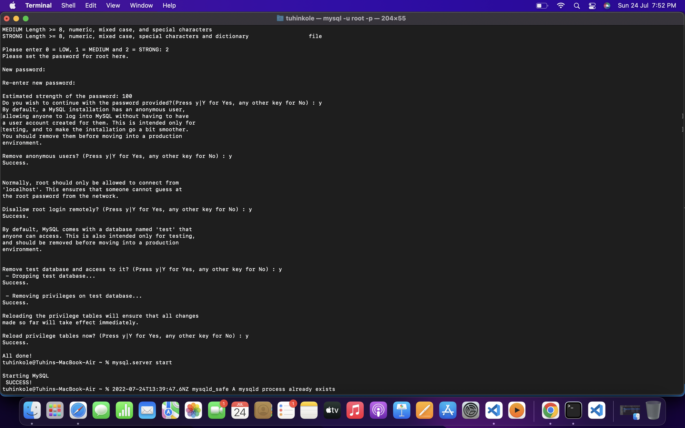

On macOS, you can install MySQL easily using Homebrew.
Run: 

brew install mysql

after successfully install

You can now start the MySQL server by running: 

brew services start mysql

Now we need to secure the MySQL server. By default the server comes without a root password, so we need to make sure it’s protected.

Run:

mysql_secure_installation

The procedure can take a while, but it gives a lot of power to make sure you get the best defaults out of the box:

Since we used brew services start mysql to start MySQL, your Mac will re-start it at reboot. You can run:

brew services stop mysql

You can also avoid this daemon mode (that’s what we call programs that always run in the background and restart when the computer is restarted) by running:

mysql.server start

This will start MySQL and will keep it running until the computer is shut down, or until you run:

mysql.server stop

Now you can connect to the server using the command:

mysql -u root -p!

